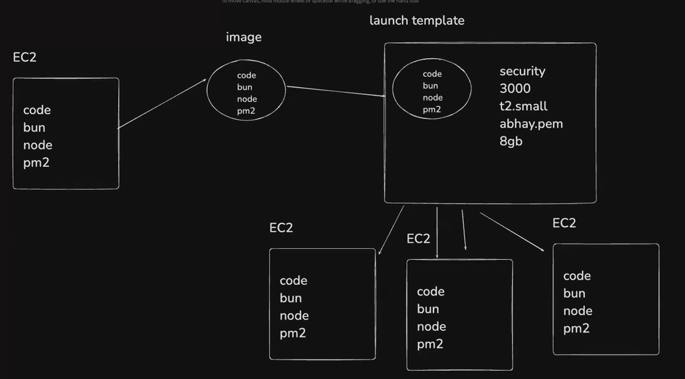
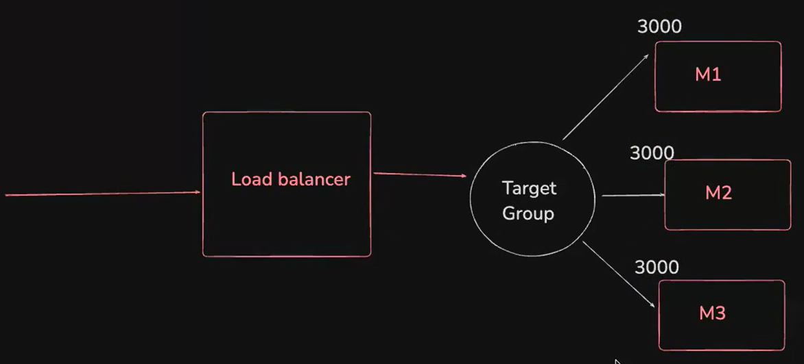

### Todays class slide link:

https://petal-estimate-4e9.notion.site/Autoscaling-groups-1a27dfd1073580adaaccc785189f156f

---

### Today's Class Context:  

#### First read `02_ASG_$_Load_balancer.md` to get the idea what are we learning today then start from here:

1. **First create an EC2 VM** (witn security 3000 port opened for testing) 
2. **Clone the ASG repository** from [NIHAR-DEBNATH's GitHub](https://github.com/NIHAR-DEBNATH/ASG)  
3. **Install required package managers**: Bun, Node.js, and PM2  
4. **Set up and run the application**:  
   - After executing `index.ts`, ensure everything is working correctly  

   ```sh
   which bun
   # when running the application run this command first and 
   # copy the output (/home/ubuntu/.nvm/versions/node/v22.15.0/
   # bin/bun)
   echo $PATH
   # now run this command first and copy the output untill the 
   # first coloun (/home/ubuntu/.nvm/versions/node/v22.15.0/bin)
   # we will need these output for launch instance
   ```
- These step-3 and step-4 is shown in the repo README.md
- When everything succesfully runs check 

5. **Create an image of the VM**  
   - Select the specific instance and click on actions button, then click on the Image and templates, then click on the Create image
   - Read the file `05_image.md` to get the basic image idea
6. **Set up a launch template** using the created image  
   - That AMI
   - Instance type: `t3.micro`
   - Security group that allows HTTP/HTTPS(port-80/port-443) + SSH(port-22) + custom-port(post-3000/port-8080)
   - User Data script that starts the Node.js app
   - IAM role to allow CloudWatch Logs access

   - In the **Advanced Tab (User Data section)**, add the following pre-run script:  
   - Replace a part of the pm2 and path script with the copied texts

   ```sh
   #!/bin/bash 
   export PATH=$PATH:<paste the path text here>
   pm2 ls
   pm2 start --interpreter <paste the path of bun which you copied when running the application on the base instance> /home/ubuntu/ASG/index.ts
   ```  
   - Your final script should look like this:
   ```sh
   #!/bin/bash
   export PATH=$PATH:/home/ubuntu/.nvm/versions/node/v22.20.0/bin
   pm2 ls
   pm2 start --interpreter /home/ubuntu/.nvm/versions/node/v22.20.0/bin/bun /home/ubuntu/ASG/index.ts
   ```
   - Read the file `06_launch_instances.md` to get the basic launch template idea

### Upto here our structure kinda looks like this:




7. **Create a target group**  
   - Read 08_target_group.md to learn how you can create a target group



#### Here comes a interesteing point is that you can create a load-balancer by your own or you can create it directly through autoscalling groups 

8. **Set up an Auto Scaling Group (ASG)**  
   - You'll get an option to create a new **Load Balancer**—configure both properly
   - Read 09_asg_creation.md for understanding

- when creating the load balancer in the asg i selected the port 80 but the load balancer but it not automatically created a security opening at 80 port, so after the complete creation of the asg i have to manually go to the load balancer and open the 80 post in the network inbound rule. 
- steps > load balancer > click on the checkapp-1 (load balancer name) > security > click security group id (sg-087885d880f0b0d5c)- it will open a new page > then edit inbound rules and add port 80 and update

9. **Verify the setup**  
   - dont visit the ec2 instances ip that is wrong you have to go to the load balancer page then copy the ip that load balancer provides called `DNS name`
   - now Visit `http://load-balancer-ip/host`  
   - Refresh the page multiple times  
   - You should see different instance IPs appearing, confirming that the cluster is distributing traffic across multiple instances  

#### But after all of these we are still scalling our app manually, so how can i scale it dynamically and explain it in very details

10. **Set up an Auto Scaling Policy**  
   - Read 10_auto_scalling_policy.md for understanding

9. **Now verify the whole setup**  
   - Visit `http://load-balancer-ip/cpu` many times  
   - You should see that new instances are creating when you are hitting that page
   - after that if you visit `http://load-balancer-ip/host` this page only once you will see that the instances are reducing to their minimum value, because no cpu intensive tasks are running

This ensures that your **Auto Scaling Group (ASG) is successfully handling load balancing** by utilizing different instances dynamically. 🚀