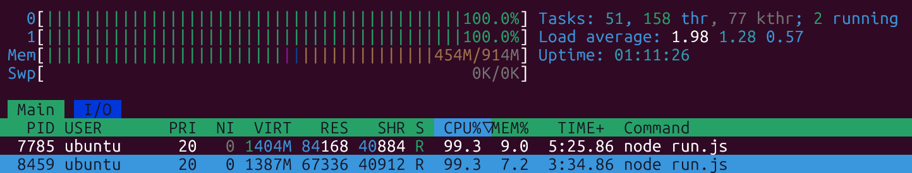

### Todays class slide link:

```link
https://projects.100xdevs.com/tracks/monitoring-1/Monitoring--Logging-and-Newrelic-1
```


---


### Steps of todays class

1. Crete a virtual machine from either AWS instances or DigitalOcean Droplets, then ssh into it
2. now log into newrelic, (First time log in will give you lot of options, just dont select any options right now and refresh the page )
3. now click to the `Integrations & Agents` section from the side bar,choose the `Docker` from `popular` section (The reason we are using docker instead of linux or nodejs is beacause when we dont need the newrelic agent on our machines we can simpley kill the docker process and newrelic agent will delete automatically, we ar safe from doing the delete process internally from our machine)

4. `Enter your user key` from here choose `Create a new key`, copy the key and put it into `.env` file and click continue

5. `Select an installation method` from here choose the `Basic` then `Select docker network` from here choose the `Default Host` (besaue we want newrelic to talk to the server) and click continue

6. `Install the New Relic infrastructure agent` from here copy the command and edit it slight (because we have to make it `sudo`)
    - Your command should something looks like this and click continue

```sh
sudo docker run \
  --detach \
  --name newrelic-infra \
  --network=host \
  --cap-add=SYS_PTRACE \
  --privileged \
  --pid=host \
  --volume "/:/host:ro" \
  --volume "/var/run/docker.sock:/var/run/docker.sock" \
  --volume "newrelic-infra:/etc/newrelic-infra" \
  --env NRIA_LICENSE_KEY=*************************** \
  newrelic/infrastructure:latest
```

- Before pasting the command into our virtual machine, make sure you have installed the docker on the mahine
- After that paste the command and it will start the installation


7. `Test the connection` from here when the docker finally runs the newrelic image after that click on the `Test connection` and you will see a `Infrastructure Agent | succesfull` status and click `See your data`

- Be patient here, because the newrelic is so slow to fetch all the things, And put Newrelic in back and do next learnings

8. After that you will go to the `All Entities` section from side bar and you will see on the `Host` section there is one agent is running ans container also there is 1 container is runnign which is newrelic agent itself. (if we now go the vm and do `sudo docker run -d mongo`, docker will pull the images and will run a container after that we will see the container showing 2, the more container you will run the more container will increase)

9. After all of these setups, we go back to the Virtual Machine and installed the NODEJS and ran a infinitine loop program, and from different terminals we using the `htop` to see the cpu or memory usage as we can see that the spu usage is 100% for single core 



- Now on the newrelic insfractructure-agent graphs you will notice there is a sudden spike cames in for cpu

---

10. Now we will Create our own dashboard on newrelic for personalizing our own needs, Click on Dahboard and Create Dashboard `Create a new dashboard` > give it a name and > permissions `Edit - everyone in account`, so now our own dashboard is created and how can we add the all charts which we were seeing over there on the insfractructure-agent dashboard

- for that we have to write some language called `NRQL`, it is similar to SQL but newrelic uses it own language

- so go back to the insfractructure-agent dashboard from all entities and you will see a cpu usage chart and click on the 3 dot on right side and  select view query

```sql
SELECT average(cpuPercent) AS `CPU used %` FROM SystemSample WHERE (entityGuid = 'NjY*****************************') TIMESERIES AUTO SINCE 30 minutes ago UNTIL now
```

- You will see a query something like this, and you can play will this command a little inside the newrelic websites cli

- you will a run button and try this commands 

```sql
SELECT * FROM SystemSample

SELECT average(cpuPercent) AS `CPU used %` FROM SystemSample WHERE (entityGuid = 'NjY*****************************')

SELECT average(cpuPercent) AS `CPU used %` FROM SystemSample WHERE (entityGuid = 'NjY*****************************') TIMESERIES
```


- Now return back to the your created dashboard and click add widget and `Add a Chart` > you will see a cli is opened and you can paste the nrql query which you copied from the agents cpu usage chart

- And you can add for all the things `Memory usage`, `disk usage`, `load average` from the insfractructure-agent

- There is a another playing with the command is, run the infinite loops program again on the virtual machine and using `htop` see the cpu is 100%, and come back to the newrelic and run this command

```sql
SELECT latest(cpuPercent) AS `CPU used %` FROM SystemSample WHERE (entityGuid = 'NjY5N*******************') SINCE 30 minutes ago UNTIL now
```

- you will see

```
CPU usage (%)
Since 1 hour ago

100
CPU used %
```

- and you can add this command on the dashboard also

---

11. Now go for the alerts 

- from your dashboard select any graph like a cpu usage chart and click on the 3 dot on right side and `Create new alert condition`

- this thing will come out `Create new alert condition—query mode` and you will see your nrql for that chart

```sql
SELECT average(cpuPercent) AS `CPU used %` FROM SystemSample WHERE entityGuid = 'NjY5**********************************'
```

- dont need to change it unless its needed, click next

- make everything default except the When a query returns a value above 30, so that if the cpu usage is above 30% for 5 minutes then send a critical alert, or read this if you wants more changes [alert](./09_alert.md)

- after that click next and now we have to create a policy

- give the name and click create a new policy and then give policy name and then rest default and click `Save & set up` button

- it will open a `Create a new workflow to get notified` then select EMAIL for now... [more to learn](./10_alert_policy.md)


- click create new destination

- 

- then celect your email or add more emails and give a name for the backend server then clic save destination

- after that click save and then click activate workflow then click save condition

- after that you will go to the Alerts/Alert Conditions section and do a hard refresh to see that that alert is created and it will give notification to the email address if the cpu usege goes high for 5 minutes


---

# restart from 1:06:00